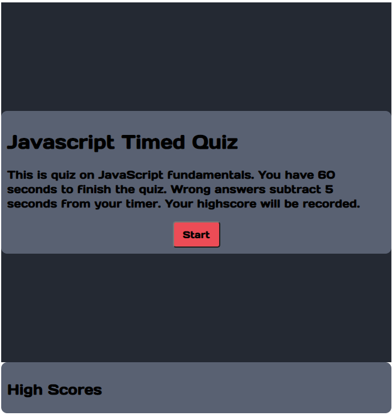

# Multiple-Choice-Quiz-App

## About
This is a quiz app that will ask 5 questions about Javascript.

The user is given 60 seconds to chose corrects answers from 4 multiple choices for each question.
After the user selects an answer, the correct answer will show as green and the incorrect answer will show as red.
For each correct answer the User is given 20 points (resulting in a maximum score of 100) while each incorrect answer subtracts 5 seconds from the lock.
At the end of the quiz, the User is promted to enter their name which is saved along with their score on local storage. Only the top 5 scores are stored and shown at the bottom of the screen.
All questions are random order.

Access the quiz at:
https://famesmyname.github.io/Multiple-Choice-Quiz-App/

## Instructions

* On the Home screen, press start to begin the quiz and start 60 sec timer.

* After being given a random question, click on one of the multiple choice options to be your answer.

* After choosing an answer, the correct answer will be shown in green while incorrect answers are shown in red. Press "Next" to go to the next question.

* After the 5 questions are complete, either press "restart" to start the quiz over without saving or type in your name and press "Save Score" to save your score.

* The top 5 highest scores will be saved and displayed at the bottom of the screen.

## Credits

The color scheme was inspired by Nike gray sports bra.

## Version History

1.0     -Release version with requested features and functionality
1.1     -Added penalty of 10 seconds off the clock for wrong answers (JS 178-180)
        -Have highscore render after page is refresh which pulls saved scores. (JS 27-28)
        -Added a clear score button to clear the high score (JS 244-249)